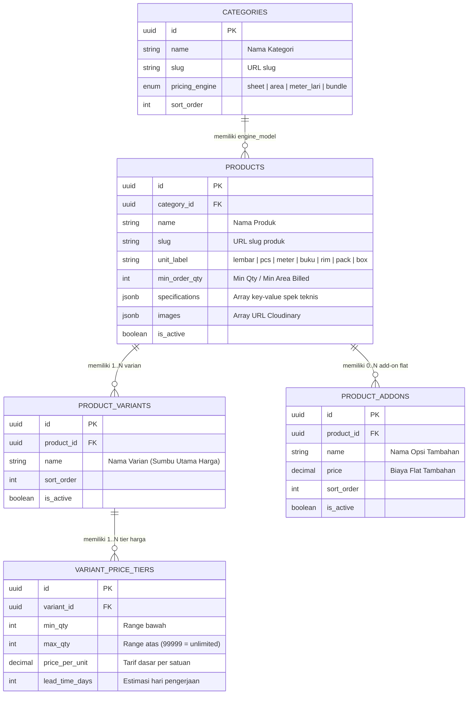

# PANDUAN PROTOKOL INPUT KATALOG PRODUK JOGLO PRINT
*Dokumen Standar Operasional untuk Admin (Manusia) & Agent AI (LLM Ingestion)*

---

## 1. STRUKTUR & RELASI DATA (DATA MODEL)

Data katalog Joglo Print dibangun di atas **Supabase PostgreSQL** dengan relasi relasional 4-tingkat:



---

## 2. 4 PRICING ENGINE GUARD (MATRIKS PERILAKU SISTEM)

Setiap Kategori mengunci (*guard*) perilaku kalkulator produk:

| Engine | Satuan Default (`unit_label`) | Input di Publik | Rumus Hitung Total Harga | Contoh Produk |
| :--- | :--- | :--- | :--- | :--- |
| **`sheet`** | `lembar`, `pcs` | Qty (Angka) | $(\text{Harga Tier} + \sum \text{Addon}) \times \text{Qty}$ | Stiker A3+, Brosur, Kartu Nama |
| **`area`** | `pcs` | Panjang (cm), Lebar (cm), Qty (pcs) | $\text{Luas } m^2 = \frac{P \times L}{10000} \times \text{Qty}$<br>$\text{Luas Billed} = \max(\text{Luas}, \text{Min Order})$<br>$\text{Total} = (\text{Harga Tier per } m^2 \times \text{Luas Billed}) + (\sum \text{Addon} \times \text{Qty})$ | Banner MMT, Spanduk Outdoor, Albatros |
| **`meter_lari`** | `meter`, `m` | Panjang Meter (Angka) | $(\text{Harga Tier per meter} + \sum \text{Addon}) \times \text{Panjang Meter}$ | DTF Roll, Kain Textile, Polyflex |
| **`bundle`** | `buku`, `rim`, `pack`, `box` | Qty Paket (Angka) | $(\text{Harga Tier per bundle} + \sum \text{Addon}) \times \text{Qty}$ | Nota NCR, Karcis, Stopmap |

---

## 3. ATURAN DUAL-AXIS: VARIAN VS ADD-ON

Sistem Joglo Print memisahkan opsi produk menjadi **2 Sumbu Independen**:

```
TOTAL HARGA PER SATUAN = [ HARGA VARIAN (Volume-Tiered) ] + [ TOTAL ADD-ON TERPILIH (Flat) ]
```

### A. Kapan Masuk ke VARIAN? (`product_variants`)
- **Definisi**: Sumbu utama produk yang **memiliki tabel harga grosir sendiri (bertingkat)** atau mengubah substansi bahan utama.
- **Karakteristik**: Wajib dipilih 1 oleh pembeli (*radio / single-select*).
- **Contoh Kasus**:
  - *Stiker A3+*: `Tanpa Cutting`, `Kiss Cut (Setengah Putus)`, `Die Cut (Putus Total)`.
  - *Banner MMT*: `Flexi Standar 280gr`, `Flexi Higress 340gr`, `Flexi Korea 440gr`.
  - *DTF Print*: `Cetak DTF 58cm Standar`, `Cetak DTF 58cm High-Density`.
  - *Nota NCR*: `1/4 Folio (2 Ply)`, `1/2 Folio (2 Ply)`, `1 Folio Penuh (2 Ply)`.

### B. Kapan Masuk ke ADD-ON? (`product_addons`)
- **Definisi**: Opsi pelengkap/finishing tambahan yang **harganya flat per satuan** dan tidak memiliki tabel tiering rumit.
- **Karakteristik**: Opsional, bisa dipilih atau dilewati (*checkbox / optional modifier*).
- **Contoh Kasus**:
  - *Stiker A3+*: `Laminasi Glossy (+Rp 2.000)`, `Laminasi Doff (+Rp 2.000)`.
  - *Banner MMT*: `Mata Ayam 4 Sudut (+Rp 0)`, `Selongsong Samping (+Rp 0)`, `Keling Mata Ayam Keliling (+Rp 5.000)`.
  - *Nota NCR*: `Nomorator Urut (+Rp 1.500)`, `Perforasi Sobek (+Rp 500)`.

---

## 4. TATA CARA INPUT STEP-BY-STEP (ADMIN DASHBOARD)

### 📌 Langkah 1: Kategori & Engine Guard
1. Buka route `/admin/kategori`.
2. Pastikan kategori tujuan sudah ada dan badge **Engine Model** sesuai kebutuhan (`sheet`, `area`, `meter_lari`, `bundle`).

### 📌 Langkah 2: Buat Master Produk
1. Buka route `/admin/produk` ➜ Klik tombol **`+ Tambah Produk`**.
2. Masukkan field berikut:
   - **Nama Produk**: Nama resmi & komersial (contoh: *Stiker Vinyl Putih Glossy A3+*).
   - **Kategori**: Pilih kategori induk.
   - **Satuan (Unit Label)**: Pilih satuan (`lembar`, `pcs`, `meter`, `buku`, dll).
   - **Min Order Qty**:
     - *Sheet/Bundle/Meter*: Minimal kuantiti order (misal `1` atau `10`).
     - *Area ($m^2$)*: Minimal luas meter persegi yang ditagihkan (biasanya `1` = $1.0\ m^2$).
   - **Deskripsi**: Deskripsi ringkas 2-3 paragraf.
   - **Spesifikasi Teknis**: Tambahkan baris Key-Value, contoh:
     - `Bahan` : Vinyl Waterproof Premium
     - `Area Cetak` : 31.5 x 47.5 cm
     - `Resolusi` : 2400 x 2400 DPI
   - **Foto Produk**: Upload URL gambar Cloudinary yang valid.

### 📌 Langkah 3: Konfigurasi Varian & Tier Harga
1. Di baris produk, klik tombol **`Varian (X)`**.
2. Tambahkan varian-varian utama produk.
3. Pada masing-masing varian, klik **`Tier Harga`** dan isi rentang kuantiti tanpa ada gap/celah:
   - *Tier 1*: Min `1` — Max `9` | Harga: `Rp 8.500` | Lead Time: `1` hari
   - *Tier 2*: Min `10` — Max `49` | Harga: `Rp 7.500` | Lead Time: `1` hari
   - *Tier 3*: Min `50` — Max `99999` | Harga: `Rp 6.500` | Lead Time: `2` hari

> ⚠️ **PENTING UNTUK ENGINE AREA:**
> `price_per_unit` pada tier adalah **Harga per $m^2$** (bukan harga total per lembar banner).

### 📌 Langkah 4: Konfigurasi Add-on (Jika Ada)
1. Kembali ke list produk, klik tombol **`Add-on (X)`**.
2. Tambahkan nama finishing flat dan harganya (misal: `Laminasi Glossy` -> `2000`).

### 📌 Langkah 5: Verifikasi E2E
1. Klik tombol **`Lihat di Publik ↗`** untuk membuka halaman publik `/produk/[slug]`.
2. Uji coba:
   - Pilih Varian & Add-on.
   - Masukkan Qty atau Ukuran P x L.
   - Klik **`+ Tambah ke Pesanan`** untuk memverifikasi item masuk ke Drawer Pesanan.
   - Klik **`Beli Langsung via WhatsApp`** dan pastikan teks draft WA terbentuk dengan harga dan link produk yang presisi.

---

## 5. FORMAT STANDAR UNTUK AGENT LLM / BATCH INGESTION (JSON)

Jika AI Agent atau skrip otomatis melakukan input/seeding data, gunakan payload struktur JSON standar berikut:

```json
{
  "category_slug": "stiker-label",
  "product": {
    "name": "Stiker Vinyl Transparan A3+",
    "slug": "stiker-vinyl-transparan-a3",
    "unit_label": "lembar",
    "min_order_qty": 1,
    "description": "Stiker plastik transparan tahan air untuk label botol dan kemasan bening.",
    "specifications": [
      { "key": "Bahan", "value": "Vinyl Transparan Waterproof" },
      { "key": "Area Cetak", "value": "31.5 x 47.5 cm" },
      { "key": "Mesin", "value": "Fuji Xerox Digital Press" }
    ],
    "images": [
      "https://res.cloudinary.com/jogloprint/image/upload/v1/sample-stiker.jpg"
    ],
    "is_active": true
  },
  "variants": [
    {
      "name": "Kiss Cut (Setengah Putus)",
      "sort_order": 1,
      "price_tiers": [
        { "min_qty": 1, "max_qty": 9, "price_per_unit": 9000, "lead_time_days": 1 },
        { "min_qty": 10, "max_qty": 49, "price_per_unit": 8000, "lead_time_days": 1 },
        { "min_qty": 50, "max_qty": 99999, "price_per_unit": 7000, "lead_time_days": 2 }
      ]
    },
    {
      "name": "Die Cut (Putus Total)",
      "sort_order": 2,
      "price_tiers": [
        { "min_qty": 1, "max_qty": 9, "price_per_unit": 11000, "lead_time_days": 1 },
        { "min_qty": 10, "max_qty": 49, "price_per_unit": 10000, "lead_time_days": 1 },
        { "min_qty": 50, "max_qty": 99999, "price_per_unit": 9000, "lead_time_days": 2 }
      ]
    }
  ],
  "addons": [
    { "name": "Laminasi Doff", "price": 2000, "sort_order": 1 },
    { "name": "Laminasi Glossy", "price": 2000, "sort_order": 2 }
  ]
}
```

---

## 6. VALIDATION & ANTI-ERROR CHECKLIST

Sebelum produk dipublikasikan, wajib checklist 5 poin ini:
- [ ] **Kategori Engine Cocok**: Produk $m^2$ tidak boleh masuk ke kategori `sheet`.
- [ ] **Tier Harga Berurutan**: Tidak ada rentang yang terputus (contoh salah: 1-10 lalu 12-20).
- [ ] **Tier Terakhir Ditutup**: Tier paling akhir diberi `max_qty: 99999` agar order dalam jumlah banyak tetap terhitung.
- [ ] **Satuan Sesuai Logika**: `unit_label` sesuai dengan apa yang dimengerti pembeli (contoh: *buku* untuk nota, *lembar* untuk stiker).
- [ ] **Status Aktif**: Master produk dan minimal 1 varian bertanda `is_active = true`.
